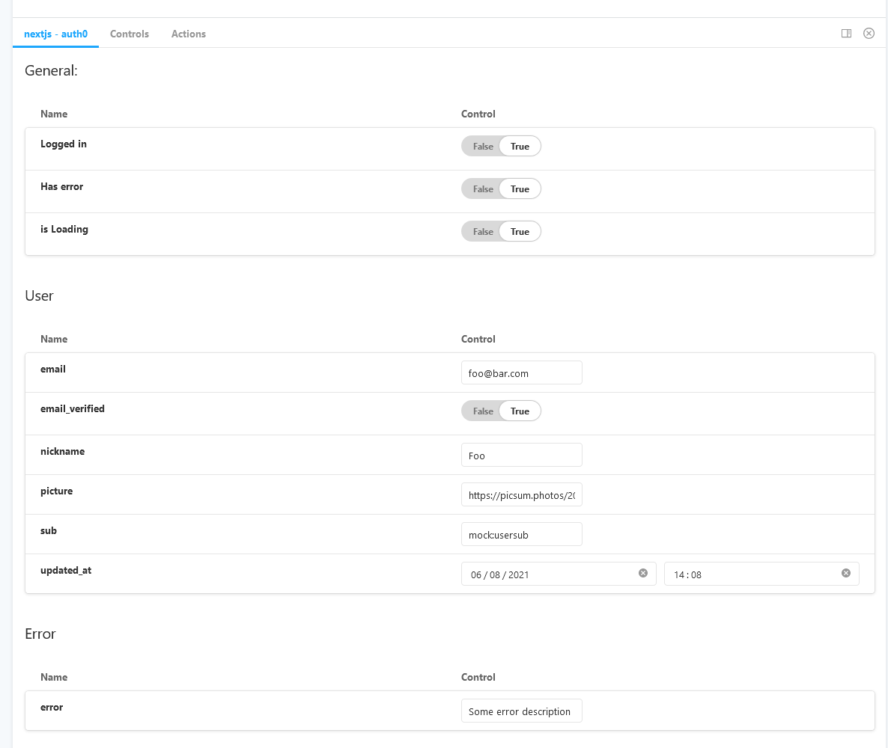

# storybook-addon-next-auth0

Allows you to use [`useUser`](https://auth0.github.io/nextjs-auth0/modules/frontend_use_user.html) from [`@auth0/nextjs-auth0`](https://github.com/auth0/nextjs-auth0)

It decores your stories with a mocked [`UserProvider`](https://auth0.github.io/nextjs-auth0/modules/frontend_use_user.html#userprovider) that you can control on a storybook panel.



## Install

```
npm i -d storybook-addon-next-auth0
```

## configuration

add "storybook-addon-next-auth0" to you `.storybook/main.js` addons

That's all.

### example
```js
module.exports = {
const path = require("path");

module.exports = {
  "stories": [
    "../components/**/*.stories.@(js|jsx)",
    "../pageStories/**/*.stories.@(js|jsx)",
  ],
  "addons": [
    'storybook-addon-next-auth0',
    "@storybook/addon-links",
    "@storybook/addon-essentials",
  ],
}
```
## Stories

You can pass the initial useUser value to any story though story's parameters

### example
[stories/Example.stories.js](stories/Example.stories.js)


```js
import React from "react";
import { UserPrint } from "./Example";

export default {
  title: "Example/User",
  component: UserPrint,
  parameters: {
    initialUser: {
      isLoading: true,
    }
  }
};

export const Loading = () => <UserPrint />

export const Logged = () => <UserPrint />
Logged.parameters = {
  initialUser: {
    isLoading: false,
    user: {
      email: 'john@doe.com',
      email_verified: true,
      nickname: 'Joe',
      picture: 'https://picsum.photos/200',
      sub: 'mock:johndoe',
      updated_at: '2021-04-02T12:42:42.042Z',
    }
  }
}

export const ErrorStory = () => <UserPrint />
ErrorStory.parameters = {
  initialUser: {
    isLoading: false,
    error: 'Something went wrong'
  }
}

```

